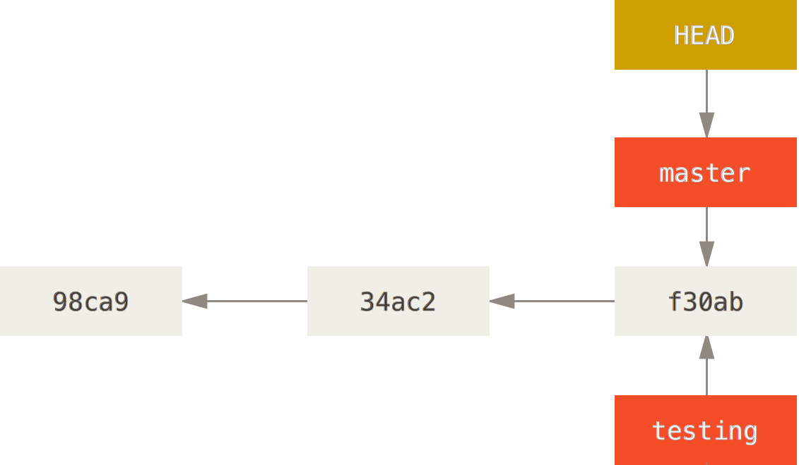
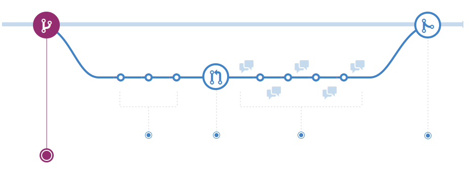
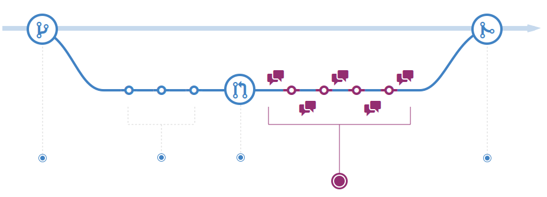
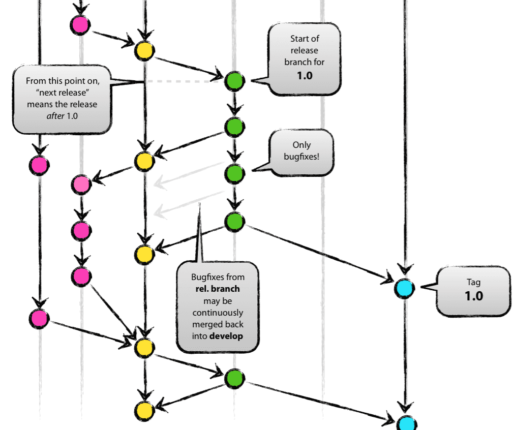

:title: Introduction workshop Git & Github
:author: David Heijkamp
:keywords: git, github, version control, workshop
:css: css/presentation.css

----

Introduction workshop Git & Github
==================================

----

Practical
=========

* Please reply to the GitHub invitation for the workshop-naturalis organization, if you haven't done so already.
* You can open this presentation in your browser: `<http://10.42.1.198>`__

----

Agenda
======

* Introduction

  * Version control
  * Git
  * GitHub

* Terminology and theory

* Getting started

  * Installation
  * Configuration

* Basic operations

  * init
  * clone
  * ...

* Workflows with Git

----

Introduction
============

----

Version control
===============

*“Version control is a system that records changes to a file or set of files over time so that you can recall specific versions later.”*

* Local

    Example: time-stamped directories

* Centralized

    Example: CVS, Subversion

* Distributed

    Example: Git, Mercurial

Source: `Pro Git <http://git-scm.com/book/en/v2/Getting-Started-About-Version-Control>`__

----

Git
===

A.k.a.
------

The stupid content tracker

Primary goal
------------

Maintain snapshots of a directory’s contents

Etymology
---------

From Middle English get (“offspring”, especially “illegitimate offspring”).

Source: `Wiktionary <http://en.wiktionary.org/wiki/git#English>`_

----

GitHub
======

GitHub is a web-based Git repository hosting service, which offers all of the distributed revision control and source code management (SCM) functionality of Git as well as adding its own features:

* Wiki
* Issues
* GitHub pages
* Pull requests

----

Terminology and theory
======================

----

Term: Repository
================

A repository is a collection of *commits*,

each of which is an archive of what the project's *working tree* looked like at a past date, whether on your machine or someone else's.

It also defines *HEAD*, which identifies the branch or commit the current working tree stemmed from. 

Lastly, it contains a set of *branches* and *tags*, to identify certain commits by name.

----

Term: The index
===============

Unlike other, similar tools you may have used, Git does not commit changes directly from the working tree into the repository.

Instead, changes are first registered in something called the index. Think of it as a way of “confirming” your changes, one by one, before doing a commit (which records all your approved changes at once).

Some find it helpful to call it instead as the “staging area”, instead of the index.

----

Term: Hash or checksum
======================

.. image:: img/hash.png
    :height: 600px
    :align: center

----

The index is an object store
============================

Objects are stored in ``.git/objects``

Check what files are in the git index:

.. code:: sh

    $ git ls-files --stage

Show a file based on the file's hash:

.. code:: sh

    $ git show 9c3f02f390174a28cbe9fc3d05285fe4a19b664e
    Copyright (C) 2015 Stichting Naturalis Biodiversity Center

You can usually abbreviate the hash to the first 6 or so characters:

.. code:: sh

    $ git show 9c3f02
    $ git show 9c3f

An older version of the same file can be shown as well:

.. code:: sh

    $ git show 07d596
    Copyright (C) 2013 Stichting Naturalis Biodiversity Center

----

Term: Working tree
==================

A working tree is any directory on your filesystem which has a repository associated with it (typically indicated by the presence of a sub-directory within it named ``.git``).

It includes all the files and sub-directories in that directory.

----

Term: Commit
============

A commit is a snapshot of your working tree at some point in time.

The state of HEAD (see below) at the time your commit is made becomes that commit’s parent. This is what creates the notion of a “revision history”.

----

A commit and its tree
=====================

.. image:: img/commit-and-tree.png
    :height: 400px
    :align: center

----

Commits and their parents
=========================

.. image:: img/commits-and-parents.png
    :height: 250px
    :align: center

----

Term: Branch
============

A branch is just a *name for a commit*, also called a reference. 

It’s the parentage of a commit which defines its history, and thus the typical notion of a “branch of development”.

----

Term: Tag
=========

A tag is also a name for a commit, similar to a branch, except that it always names the same commit, and can have its own description text.

----

Term: Master
============

The mainline of development in most repositories is done on a branch called “master”. Although this is a typical default, it is in no way special.

----

Term: HEAD
==========

HEAD is used by your repository to define what is currently checked out:

* If you checkout a branch, HEAD symbolically refers to that branch, indicating that the branch name should be updated after the next commit operation.

* If you checkout a specific commit, HEAD refers to that commit only. This is referred to as a detached HEAD and occurs, for example, if you check out a tag name.

----

Branching
=========

Branching means you diverge from the main line of development and continue to do work without messing with that main line.

----

Creating a new branch
=====================

.. image:: img/two-branches.png
    :height: 300px
    :align: center

----

Creating a new branch
=====================

----

Committing to the new branch
============================

.. image:: img/basic-branching-3.png
    :height: 300px

----

Merging: fast-forward
=====================

.. image:: img/basic-branching-4.png
    :height: 300px

----

Merging: fast-forward
=====================

.. image:: img/basic-branching-5.png
    :height: 400px

----

Merging: three-way
==================

.. image:: img/basic-branching-6.png
    :height: 400px

----

Merging: three-way
==================

.. image:: img/basic-merging-1.png
    :height: 400px

----

Merging: three-way
==================

.. image:: img/basic-merging-2.png
    :height: 350px

----

Term: Remotes
=============

Git is a distributed version control system.

*Remotes*, or remote repositories, are versions of your project that are hosted on the Internet or network somewhere.

----

Getting started
===============

----

Installing Git
==============

Instructions for Linux
----------------------

#. Open a terminal
#. Install git with the package manager of your distro:

   .. code:: sh

       $ apt-get install git
       $ yum install git
       $ pacman -S git

Instructions for Windows
------------------------

#. Download Github for Windows: https://windows.github.com
#. Click the downloaded file to start installation
#. Confirm installation
#. Fill in your credentials

Instructions for Mac
--------------------

#. Download Github for Mac: https://mac.github.com/
#. Click the downloaded file and confirm to open the downloaded file
#. Fill in your credentials
#. Click the option to install the Command Line tools

----

Configuring Git
===============

Configuration of Git repo's and client is stored in several places:

* On Github (access etc.)
* In ``/etc/gitconfig``
* ``~/.gitconfig`` or ``~/.config/git/config``
* ``.git/config`` in each repository

Before getting started you need to configure some basics (you're covered when using Github for Mac / Windows).

Check your current settings:

.. code:: sh

    $ git config user.name
    $ git config user.email

Change your settings:

.. code:: sh

    $ git config --global user.name "John Doe"
    $ git config --global user.email johndoe@example.com

Check `this chapter <http://git-scm.com/book/en/v2/Getting-Started-First-Time-Git-Setup>`__ from the Pro Git book for more info.

----

Basic operations
================

----

Assumptions
===========

Throughout the workshop we'll use:

* The command line interface (CLI) for Git (most of the time)
* The webinterface for Github
* The Github for Mac / Windows application
* ``github.com/workshop-naturalis`` as Github organization

In practice your IDE of choice will probably support Git integration as well.

----

Initializing a repo
===================

Creating or initializing a repo can be done in multiple ways:

* Locally with your Git client:

    .. code:: sh

        $ mkdir example-repo
        $ cd example-repo
        $ git init

* On Github:

    .. image:: img/newrepo.png

* With Github for Mac / Windows:

  * Create repo by clicking on +
  * Choose 'Publish' to make the repo available on GitHub

----

Cloning
=======

Cloning (checking out) an existing repo on GitHub can be done in two ways:

* First, copy the URL of the repo:

    .. image:: img/clone.png

Next thing is to clone the repo using the copied URL:

* Locally with your Git client:

    .. code:: sh

        $ git clone https://github.com/workshop-naturalis/<naam>.git

* With Github for Mac / Windows:

  * Create repo by clicking on +
  * Choose 'Publish' to make the repo available on GitHub

----

Staging files
=============

Files in a working tree are not automatically part of the index. Stage them first:

.. code:: sh

    $ git add sample.php

Check the status of the file:

.. code:: sh

    $ git status

Or check which files are in the index:

.. code:: sh

    $ git ls-files --stage

----

Committing
==========

After adding or changing a file or multiple files you can commit your changes:

* Using the command line:

    .. code:: sh

        $ git commit sample.php -m 'Added a test script'

* Commit all staged files using the command line:

    .. code:: sh

        $ git commit -a

* Using Github for Windows:

    .. image:: img/commitgithubforwindows.png

----

Branching
=========

Check which branches are available:

.. code:: sh

    $ git branch

Create a new branch:

.. code:: sh

    $ git branch newbranch

Delete a branch:

.. code:: sh

    $ git branch -D newbranch

Create a new branch and check it out:

.. code:: sh

    $ git checkout -b newerbranch

----

Stashing
========

Save unfinished changes that you don't want to commit yet

Make a new branch:

.. code:: sh

    $ git checkout -b stash-example

Create or change a file and check the state:

.. code:: sh

    $ git status

Stash your changes before switching branches:

.. code:: sh

    $ git stash
    $ ...
    $ git status
    # On branch stash-example
    nothing to commit, working directory clean
    $ git checkout master

Switch back to the branch and apply the stashed work:

.. code:: sh

    $ git checkout stash-example
    $ git stash apply

Check the `Pro Git book <http://git-scm.com/book/en/v2/Git-Tools-Stashing-and-Cleaning>`__ for more info

----

Merging
=======

Branching would be useless if we couldn't merge changes from different branches.

Make a new branch and commit a change:

.. code:: sh

    $ git checkout -b feature01
    $ vim sample.php
    $ git commit sample.php -m 'Add feature 01'

Merge the change from your feature branch into the master branch:

.. code:: sh

    $ git checkout master
    $ git merge feature01

----

Merge conflicts
===============

Sometimes you get conflicts while merging. Solving these is (relatively) straightforward:

Make another feature branch and commit a change:

.. code:: sh

    $ git checkout -b feature02
    $ vim sample.php
    $ git commit sample.php -m 'Add feature 02'

Checkout master and commit a change on the same line in the same file:

.. code:: sh

    $ git checkout master
    $ vim sample.php
    $ git commit sample.php -m 'Screw things up'

Try to merge the feature branch:

.. code:: sh

    $ git merge feature02
    Auto-merging sample.php
    CONFLICT (content): Merge conflict in sample.php
    Automatic merge failed; fix conflicts and then commit the result.

----

Resolving conflicts
===================

Git hasn’t automatically created a new merge commit. You need to resolve the conflict before committing.

Check the status for files with merge conflicts:

.. code:: sh

    $ git status

Git adds standard conflict-resolution markers to the files that have conflicts:

.. code:: sh

    <<<<<<< HEAD
    Test resolving conflicts - Let's screw things up
    =======
    Test resolving conflicts - Feature02
    >>>>>>> feature02

Resolve the conflict in your editor by replacing the entire block:

.. code:: sh

    Test resolving conflicts - Feature02

You can also use a graphical tool:

.. code:: sh

    $ git mergetool

Check the status again and finalize the merge commit:

.. code:: sh

    $ git status
    $ git commit

Check the `GitHub documentation <https://help.github.com/articles/resolving-a-merge-conflict-from-the-command-line/>`__ and the `Pro Git book <http://git-scm.com/book/en/v2/Git-Branching-Basic-Branching-and-Merging#Basic-Merge-Conflicts>`__ for more info

----

Working with remotes
====================

To be able to collaborate on any Git project, you need to know how to manage your remote repositories. In our case that will be GitHub.

Show your remotes:

.. code:: sh

    $ git remote
    $ git remote -v

Get data from your remote repository and manually merge:

.. code:: sh

    $ git fetch
    $ git merge

Or use pull to fetch and automatically merge changes:

.. code:: sh

    $ git pull

Check the `Pro Git book <http://git-scm.com/book/en/v2/Git-Basics-Working-with-Remotes>`__ for more info

----

Workflows
=========

----

GitHub Flow
===========

GitHub offers an extra feature on top of Git: Pull Requests

GitHub Flow is a simple workflow based on this feature

----

GitHub Flow
===========

----

GitHub Flow
===========

----

GitHub Flow
===========

----

GitHub Flow
===========

----

GitHub Flow
===========

----

Pull requests
=============

Create your own Pull Request

Documentation:
https://help.github.com/articles/using-pull-requests 

----

Git Flow
========

Git Flow is a more advanced and detailed workflow / branching model

----

.. image:: img/git-flow.png
    :height: 900px

----

Git Flow
========

Rule 1: Master is always in shippable state

.. image:: img/main-branches.png

----

Git Flow
========

Rule 2: Features are developed in separate branches, based on develop

.. image:: img/feature-branches.png

----

Git Flow
========

Rule 3: Keep commits related to feature branches by avoiding fast-forward merges

.. image:: img/merge-without-ff.png
    :height: 600px

----

Git Flow
========

Rule 4: Use release branches for preparing a new release

----

Git Flow
========

Rule 5: Use hotfix branches for production critical fixes

.. image:: img/hotfix-branches.png
    :height: 600px

----

Extra: Releases
===============

GitHub offers, based on Git tags, a way of working with releases:
https://help.github.com/articles/about-releases/
https://help.github.com/articles/creating-releases/

Github advises to use semantic versioning:
http://semver.org/

----

Extra: Smart commits
====================

JIRA (and GitHub issues as well) supports Smart Commits

Documentation:
https://confluence.atlassian.com/display/Cloud/Processing+JIRA+issues+with+commit+messages

----

Documentation
=============

* `Github Help <https://help.github.com/>`_
* `Pro Git <http://git-scm.com/book/>`__
* `Git from the Bottom Up <http://ftp.newartisans.com/pub/git.from.bottom.up.pdf>`_
* `Git cheat sheet <https://github.com/tiimgreen/github-cheat-sheet>`_
* `Git Flow <http://nvie.com/posts/a-successful-git-branching-model/>`__
* `Git Best Practices <http://sethrobertson.github.io/GitBestPractices>`__

----

Thank you
=========
